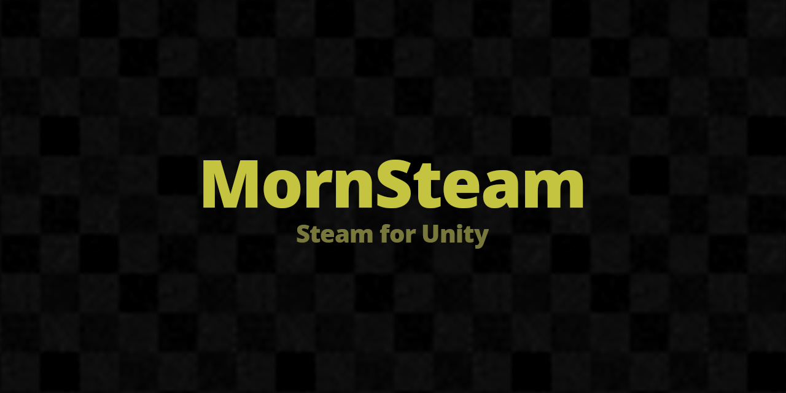

# MornSteam

<p align="center">
  
</p>

<p align="center">
  
</p>

## 概要

Steamworks.NET を薄くラップした Unity 向け Steam API ライブラリ。実績・統計・入力デバイス・言語取得などを `static` メソッドで簡潔に呼び出せます。

## 導入方法

Unity Package Manager で以下の Git URL を追加:

```
https://github.com/TsukumiStudio/MornSteam.git?path=src#1.0.0
```

`Window > Package Manager > + > Add package from git URL...` に貼り付けてください。

### 依存パッケージ

- [Steamworks.NET](https://github.com/rlabrecque/Steamworks.NET) (`com.rlabrecque.steamworks.net`)

## 機能

**初期化と状態確認**

— `MornSteamManager.Initialize()` で SteamAPI を初期化
— `MornSteamManager.Initialized` で初期化成否を確認
— `MornSteamManager.UserId` で SteamID を取得

**実績・統計**

— `TryGetAchievement(label, out isUnlocked)` で達成状態を取得
— `SetAchievement(label)` で実績を解除
— `SetStat(label, value)` で統計値を更新
— `StoreStats()` で変更を Steam サーバーに送信
— `ResetAllStats(achievementsToo)` で全統計をリセット

**入力・言語**

— `GetInputs()` で接続中のコントローラータイプ一覧を取得
— `GetCurrentGameLanguage()` で Steam クライアントの現在言語を取得

## 使い方

```csharp
using MornLib;

MornSteamManager.Initialize();

if (MornSteamManager.Initialized)
{
    MornSteamManager.SetAchievement("ACH_FIRST_PLAY");
    MornSteamManager.StoreStats();
}
```

## 注意事項

`USE_STEAM` プリプロセッサシンボルを定義することで Steam 機能が有効化されます。未定義の場合や、Standalone 以外のプラットフォーム (Switch / WebGL 等) では全 API がスタブ実装になります。

## ライセンス

[The Unlicense](LICENSE)
